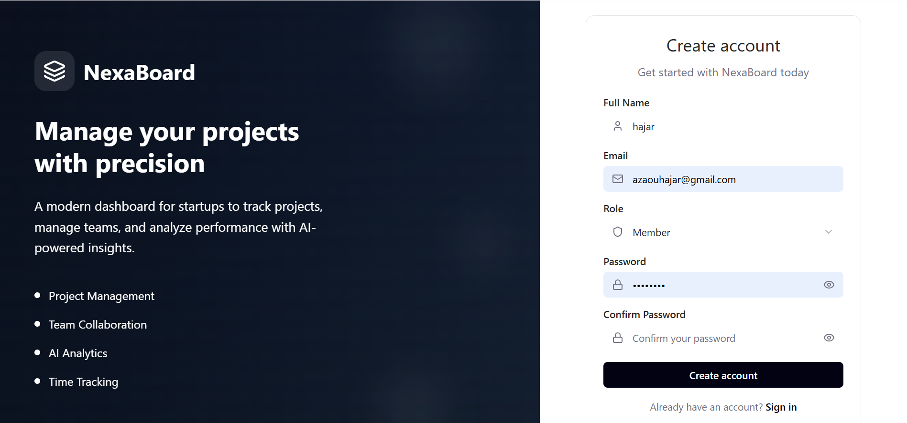
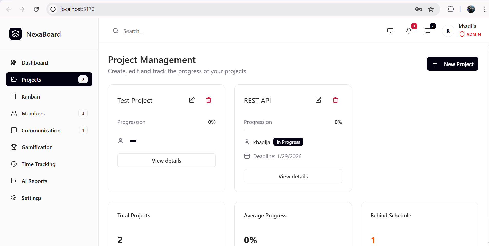
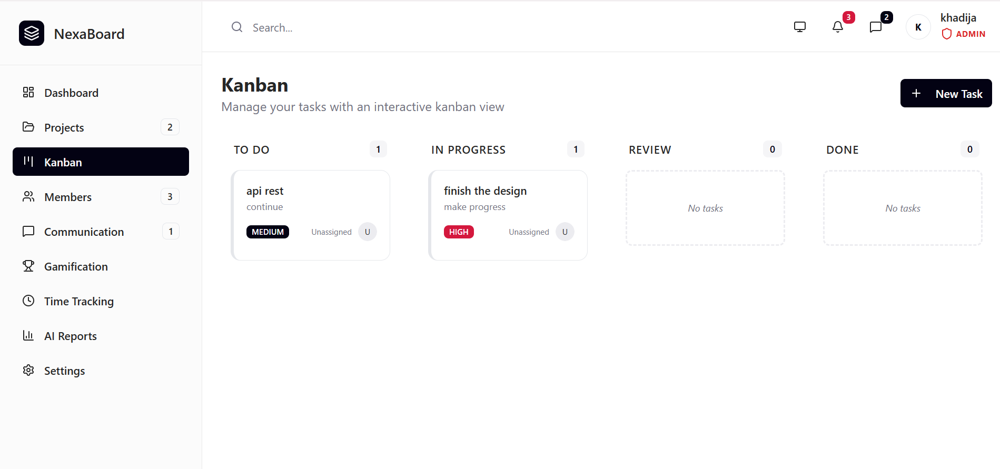
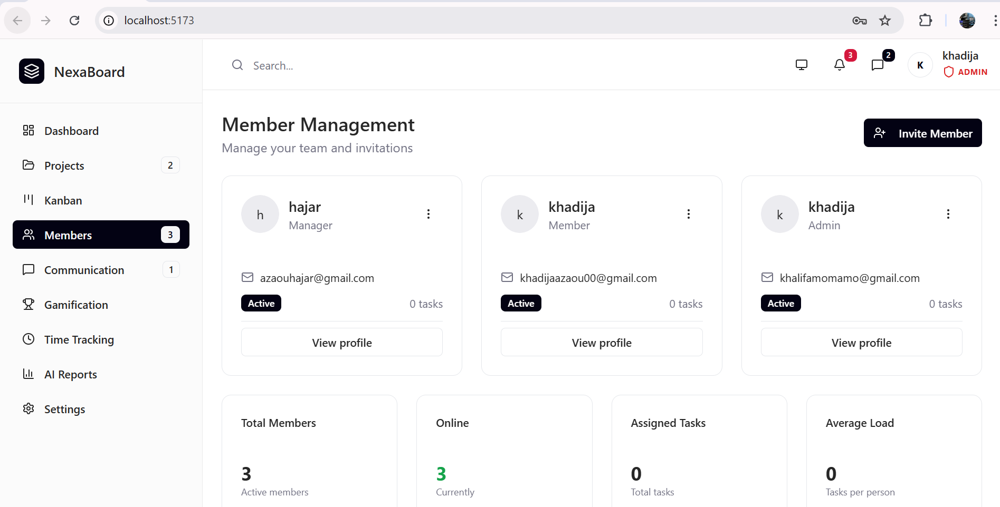
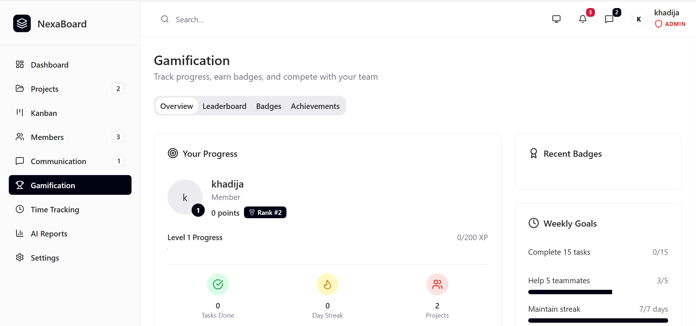
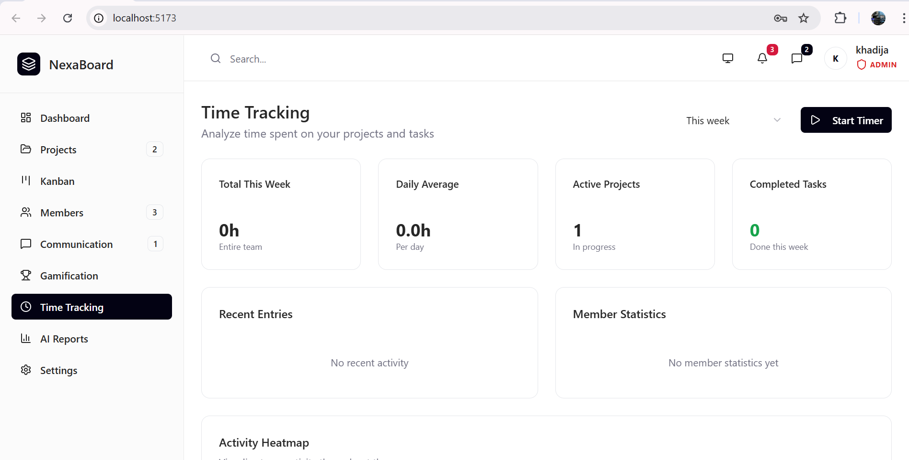

# NexaBoard - AI-Powered Project Management

**NexaBoard** est une plateforme moderne de gestion de projet conçue pour les startups. Elle permet de piloter des équipes, de gérer des tâches via un moteur Kanban interactif et de générer des rapports stratégiques grâce à l'intelligence artificielle.

---

## 🌟 Fonctionnalités Clés

- **🔐 Authentification Sécurisée** : Système de Login/Register utilisant **JWT** stocké dans des **Cookies HttpOnly** (protection maximale contre XSS).
- **📊 Dashboard Dynamique** : Vue d'ensemble des statistiques, progression globale et tâches actives en temps réel.
- **📋 Moteur Kanban Interactif** : Gestion des flux de travail (To Do, In Progress, Review, Done) avec mise à jour instantanée via API REST.
- **🤖 Intelligence Artificielle** : Génération automatique de résumés de performance et d'analyses via l'API **OpenAI**.
- **🛡️ Gestion des Rôles (RBAC)** : Accès différenciés pour **Admin**, **Manager**, et **Member**.
- **⏱️ Suivi du Temps** : Chronométrage des tâches pour analyser la productivité.
- **🌓 Interface Moderne** : Design épuré avec support du **Mode Sombre/Clair**.

---

## 🛠️ Stack Technique

### Frontend
- **Framework** : React.js (Vite)
- **Styling** : Tailwind CSS
- **Composants** : Shadcn UI / Radix UI
- **Icônes** : Lucide React

### Backend
- **Framework** : Spring Boot 3.x
- **Sécurité** : Spring Security & JWT (Cookies)
- **Base de données** : MongoDB (NoSQL)
- **IA** : Spring AI / OpenAI API
- **Tests** : JUnit 5 & Mockito

---

## 📸 Aperçu du Projet

### 1. Authentification
*Connexion sécurisée avec gestion des rôles.*



### 2. Dashboard Principal
*Statistiques réelles provenant de MongoDB.*


### 3. Gestion des Projets (CRUD)
*Interface permettant aux Managers de créer, modifier et suivre l'échéance des projets critiques.*


### 4. Tableau Kanban
*Gestion des tâches et assignations.*


### 5. Gestion des Membres & Équipes
*Annuaire des utilisateurs permettant de visualiser les rôles et de répartir la charge de travail au sein des projets.*


### 6. Gamification & Engagement
*Système de récompenses avec classement (Leaderboard) et badges pour stimuler la motivation et la complétion des tâches.*


### 6. Suivi du Temps (Time Tracking)
*Outil de mesure de la productivité permettant de chronométrer le temps passé sur chaque tâche pour une analyse de rentabilité.*


### 7. Rapports Automatisés par IA
*Génération de résumés stratégiques et d'analyses de performance via l'intégration de l'API OpenAI.*


---

## ⚙️ Installation et Configuration

### 1. Configuration du Backend (Spring Boot)
1. Allez dans le dossier `backend`.
2. Créez un fichier `src/main/resources/application.properties` :
```properties
spring.data.mongodb.uri=mongodb://localhost:27017/nexaboard
application.security.jwt.secret-key=VOTRE_CLE_BASE64_32_CHARS
application.security.jwt.expiration=86400000
application.security.jwt.cookie-name=nexaboard_token
```

### 2. Lancement : mvn spring-boot:run
Frontend
1. Prérequis : Node.js v18+.
2. Installation : npm install
3. Lancement : npm run dev

